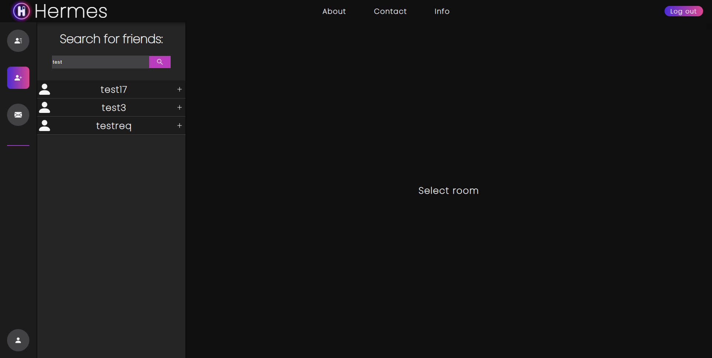

# Introduction

Hermes is an App made entirely by me as a way to further gain new skills and improve these which I already have. I'm well aware that it isn't perfect or even anywhere
close to perfection, but as previously stated, it's sole purpose is making me mature as a fullstack developer. I've decided to combine React.js frontend and Express.js
backend, as it would be easy to combine them. I implemented some security features like csrf protection, jwt token verification, storing data in cookies and user data
encryption. 

# Home Page

The mainpage is really just an eye candy with some placeholder text and phone animation. The links on the Navbar are mocked, these are just here to fill the space.
To further percolate into the app, the user has to either sign up or sign in.

# Login/Register page

The email adress is not verified in any specific way, the string just has to match the regex. 

# Main panel

After logging into the app, you can view the main panel in it's full glory.

From there you can select to either enter a conversation, find a friend, browse invitations or change your profile.

# Conversation panel

You can switch between user conversations and group chats. Clicking on the designated user results in opening a conversation.

In the group chats menu you can create a new one, add and remove users to/from already existing one and change the group leader. Every member of a group chat
gets notified when a message is being sent.

# Add Friend Menu

From there you can enter a username and click the magnifying glass icon to get the list of users matching your searching cryteria. You can add them by pressing
the plus icon which will result in them getting a new invitation in the invitations menu.

# Invitations menu

From there you can either accept or decline friendship requests from other users.

# Profile

On the profile page all you can really do is change your profile picture. I could've added changing username and password functionality but I decided that it would
just be monotenous so instead I focused on different aspects of the app.

